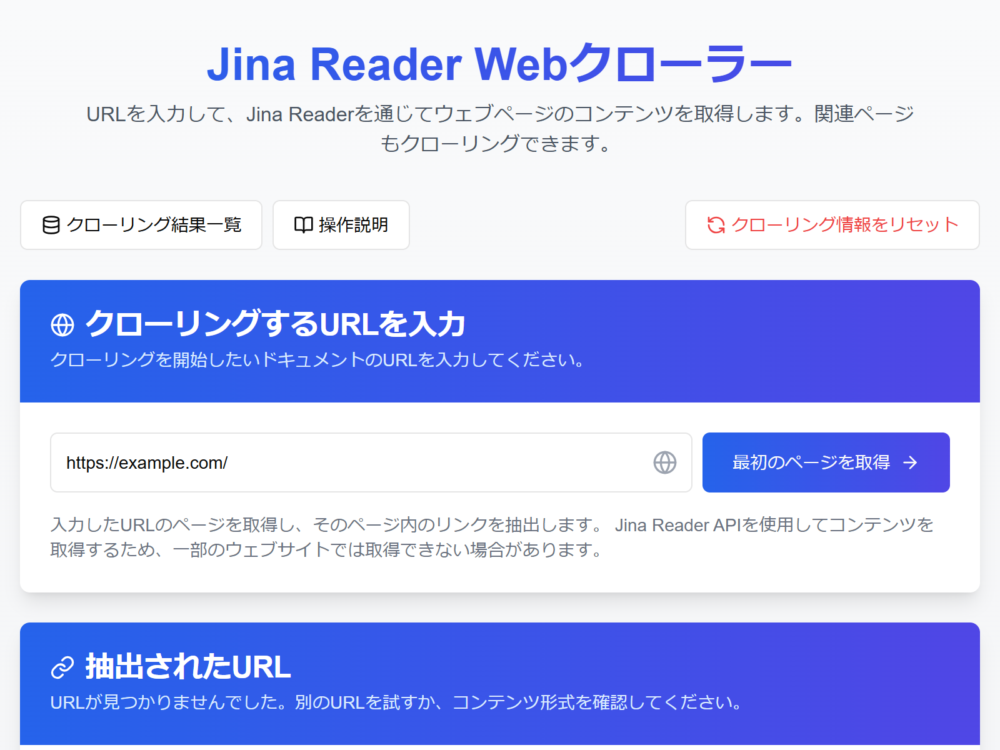
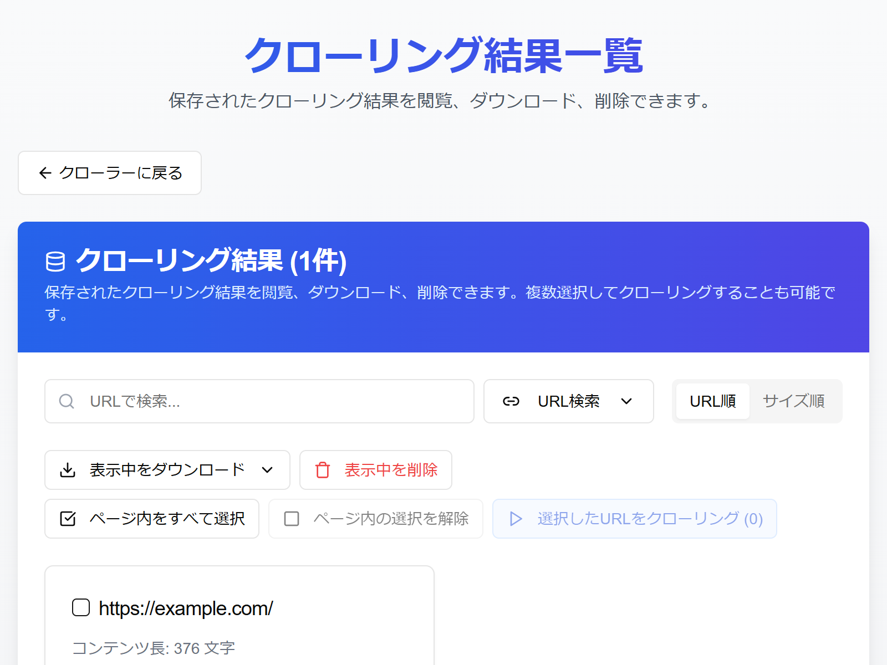
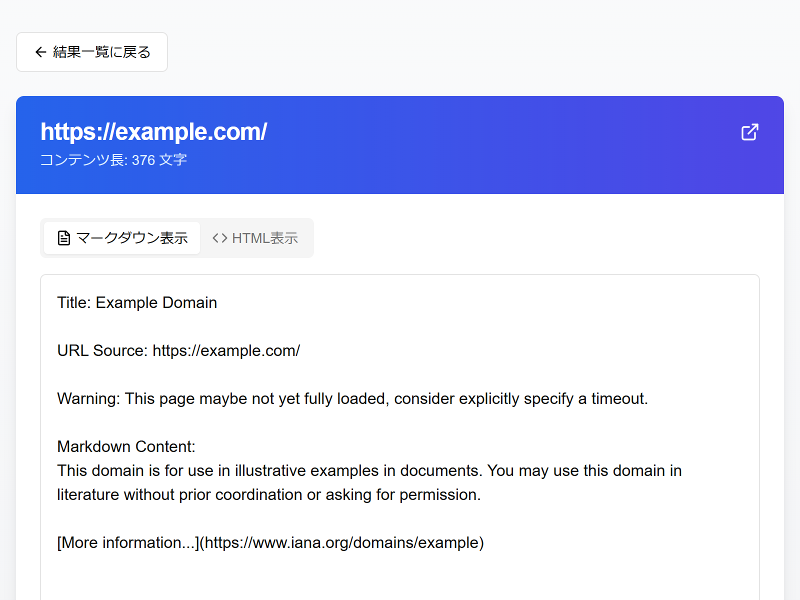

## Jina Reader Web クローラー 操作説明

このアプリケーションを使って、ウェブページの情報を集める方法をご説明します。

---

### 1. クローラー画面（メイン画面）

この画面では、情報を集めたいウェブページの最初の URL を入力し、関連するページを自動で探して内容を取得（クローリング）することができます。

**操作手順:**

1.  **最初の URL を入力**:
    - 画面上部にある入力欄に、情報を集め始めたいウェブページの URL（例: `https://example.com/docs`）を入力します。
    - URL は `http://` または `https://` で始まるものを入力してください。
2.  **最初のページを取得**:
    - URL を入力したら、右側にある「最初のページを取得」ボタンをクリックします。
    - 少し待つと、入力したページの主な内容と、そのページに含まれるリンク（同じウェブサイト内のもの）が下に表示されます。
    - もしエラーが出た場合は、メッセージを確認し、URL を修正するなどしてください。
3.  **クローリングする URL を選ぶ**:
    - 「抽出された URL」の一覧が表示されます。ここには、最初のページから見つかったリンクが表示されています。
    - 各 URL の左側にあるチェックボックスをクリックして、内容を取得したいページを選びます（複数選択可）。
    - **検索**: 一覧の上にある検索ボックスにキーワード（URL の一部やリンクの文字）を入力すると、関連する URL だけを表示できます。
    - **フィルタ**: 検索ボックスの上にある「すべて」「選択済」「未選択」タブで、表示する URL を絞り込めます。
    - **一括選択/解除**: 検索ボックスの右側にある「表示中の URL を選択」「表示中の URL を選択解除」ボタンで、現在表示されている URL すべてのチェックを一括で操作できます。
4.  **クローリングを開始**:
    - 取得したい URL を選んだら、一覧の下にある「選択した URL (〇件) をクローリング」ボタンをクリックします。
    - クローリングが始まり、進捗状況が表示されます。
5.  **進捗を確認**:
    - クローリング中は、「クローリング進捗」エリアに進捗バー、完了した数、エラーの数などが表示されます。
    - 下部のタブ（すべて、完了、処理中、エラー）で、各 URL の状態を確認できます。
6.  **エラーの再試行**:
    - もしエラーになった URL がある場合、「エラーを再試行 (〇件)」ボタンが表示されます。これをクリックすると、エラーになった URL だけ再度取得を試みます。
7.  **結果をダウンロード**:
    - クローリングが完了したら（または途中でも）、進捗エリアの右上にあるドロップダウンメニュー（例: `JSON (.json)` と表示されている部分）でダウンロードしたい形式（JSON, Markdown, テキスト）を選び、「ダウンロード」ボタンをクリックすると、取得に成功したページのデータをまとめてダウンロードできます。
8.  **設定を変更**:
    - 進捗エリアの右上にある「設定」ボタンをクリックすると、一度に処理する URL の数（並列処理数）を変更できます。数を増やすと速くなる可能性がありますが、PC やネットワークに負荷がかかる場合があります（通常は 1〜5 程度が推奨です）。
9.  **情報をリセット**:
    - 画面左上にある「クローリング情報をリセット」ボタンをクリックすると、入力した URL や抽出された URL リスト、進捗などの情報をすべて消去して最初からやり直せます（**注意:** IndexedDB に保存された完了済みの結果は消えません）。
10. **結果一覧を見る**:
    - 画面左上にある「クローリング結果一覧」ボタンをクリックすると、これまでに保存されたクローリング結果を確認できる画面に移動します。

---

### 2. 結果一覧画面

この画面では、過去にクローリングして保存されたウェブページの結果を一覧で確認し、管理することができます。

**操作手順:**

1.  **結果を確認**:
    - 保存されている結果がカード形式で一覧表示されます。各カードには URL、内容の冒頭部分、文字数が表示されます。
2.  **検索とソート**:
    - 画面上部の検索ボックスで、URL やページの内容に含まれるキーワードで結果を絞り込めます。検索対象は「URL 検索」「内容検索」で切り替えられます。
    - 検索ボックスの右にある「URL 順」「サイズ順」タブで、表示順を変更できます。
3.  **ページ移動**:
    - 結果が多い場合は、一覧の下にページ番号が表示されます。番号や「前へ」「次へ」ボタンをクリックしてページを移動します。
4.  **個別の結果を操作**:
    - 各カードにあるボタンで操作します。
      - **閲覧**: クリックすると、そのページの内容を詳しく見る画面（結果詳細画面）に移動します。
      - **ダウンロード**: クリックすると、形式（JSON, Markdown, テキスト, HTML）を選んで、このページの結果だけをダウンロードできます。
      - **削除**: クリックすると、確認ダイアログが表示され、「削除する」を選ぶとその結果がデータベースから削除されます（元に戻せません）。
5.  **表示中の結果を一括操作**:
    - 画面上部にあるボタンで、現在表示されている（検索やフィルタリング後の）結果全体に対して操作できます。
      - **表示中をダウンロード**: クリックすると、形式を選んで、表示されているすべての結果をまとめてダウンロードできます。
      - **表示中を削除**: クリックすると、確認ダイアログが表示され、「すべて削除する」を選ぶと表示されているすべての結果が削除されます（元に戻せません）。
6.  **結果を選択して再クローリング**:
    - 各カードの左上にあるチェックボックスで、再度クローリングしたい結果を複数選択します。
    - 画面上部にある「ページ内をすべて選択」「ページ内の選択を解除」ボタンで、現在のページの結果を一括選択/解除できます。
    - 選択後、右上の「選択した URL をクローリング (〇件)」ボタンをクリックすると、選択した URL がクローラー画面に送られ、クローリングを開始できます。
7.  **クローラー画面に戻る**:
    - 画面左上にある「クローラーに戻る」ボタンをクリックすると、メインのクローラー画面に戻ります。

---

### 3. 結果詳細画面

この画面では、結果一覧画面で選んだ特定のウェブページについて、取得された内容を詳しく確認できます。

**操作手順:**

1.  **内容を確認**:
    - 画面中央の大きなエリアに、取得されたページの内容が表示されます。
    - 内容が長い場合は、エリア内をスクロールして全体を見ることができます。
2.  **表示形式を切り替え**:
    - コンテンツ表示エリアの上にある「マークダウン表示」「HTML 表示」タブをクリックすると、表示形式を切り替えられます。
      - **マークダウン表示**: Jina Reader API から取得した元の Markdown テキストを表示します。
      - **HTML 表示**: Markdown を HTML に変換して、見出しやリストなどが整形された状態で表示します。
3.  **元のページを開く**:
    - 画面上部の URL の右側にある外部リンクアイコン（四角から矢印が出ているアイコン）をクリックすると、元のウェブページを新しいタブで開きます。
4.  **ダウンロード**:
    - 画面下部の「ダウンロード」ボタンをクリックし、表示されるメニューから形式（JSON, Markdown, テキスト, HTML）を選ぶと、このページの結果をダウンロードできます。
5.  **削除**:
    - 画面下部の「削除」ボタンをクリックすると、確認ダイアログが表示され、「削除する」を選ぶとその結果がデータベースから削除されます（元に戻せません）。削除後は結果一覧画面に戻ります。
6.  **一覧に戻る**:
    - 画面左上にある「結果一覧に戻る」ボタンをクリックすると、結果一覧画面に戻ります。

---

### その他

- **データの保存場所**: クローリングが完了した結果は、お使いのブラウザ内の「IndexedDB」という場所に保存されます。クローリング中の情報は「Local Storage」に一時保存されます。これらのデータは、ブラウザのキャッシュや履歴を消去する際に一緒に削除される可能性がありますのでご注意ください。
- **注意点**: このツールは Jina Reader API を利用しています。そのため、ウェブサイトによってはうまく情報を取得できない場合があります。また、たくさんのページを一度にクローリングすると、お使いの PC の動作が遅くなることがあります。
